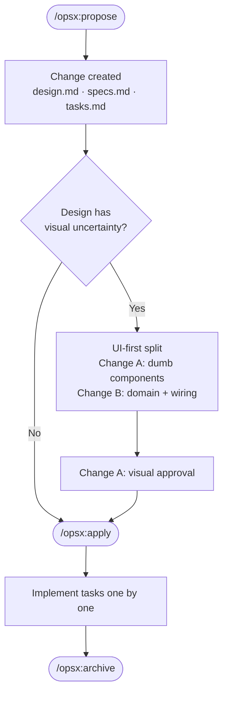

# Varal

**Varal** answers one question: _should I wash my clothes today?_

It fetches a 4-day rain forecast from the Open-Meteo API and classifies each
day into a wash recommendation, showing morning and afternoon drying windows
at a glance. Location is resolved via GPS or Brazilian CEP (postal code).

Built with Next.js 16 (App Router), TypeScript, Tailwind CSS v4, and
Inversify for dependency injection, following a Ports & Adapters architecture
that keeps business logic isolated from infrastructure and UI concerns.

## Commands

```bash
npm run dev            # Start development server at http://localhost:3000
npm run build          # Production build
npm run start          # Run the production server
npm run typecheck      # TypeScript type check
npm run storybook      # Start Storybook at http://localhost:6006 (component explorer)
npm run build-storybook # Build static Storybook output
```

## Architecture

```
Browser
  └── app/page.tsx (Server Component)
        └── ForecastService (Application)
              ├── WeatherRepository ──► Open-Meteo API
              └── LocalizationRepository ──► Nominatim / ViaCEP

src/
  core/
    domain/             # Pure business logic — no fetch, no React
    application-services/
    infrastructure/rest/ # Adapters implementing domain ports
    ContainerConfig.ts  # Inversify DI bindings
  ui/                   # Presentational components (Storybook-renderable)
  app/                  # Next.js App Router — driving adapter
    _components/        # React components (may use Next.js / hooks)
    api/                # Thin Zod → service → response controllers
```

## Development Workflow

### Small tasks

For bug fixes, copy changes, styling tweaks, or low-uncertainty features: open
a branch, make the change, run `npm run typecheck`, commit with a conventional
commit message, and open a PR.

### OpenSpec flow

For features with real design or architecture uncertainty, use the OpenSpec
workflow. It structures work into a _change_ with a design doc, specs, and
tasks — ensuring decisions are recorded before code is written.

**Use this when:** adding a new UI pattern, changing domain rules, integrating
a new data source, or anything where the shape of the solution isn't obvious
upfront.



1. `/opsx:propose` — describe the feature; artifacts are generated.
2. `/opsx:apply` — work through tasks; the agent marks each done.
3. `/opsx:archive` — record the completed change.

For UI-heavy features, split into two changes: one for dumb components
(visual approval gate), then one for domain wiring once the UI is frozen.
This keeps specs stable and domain review focused on correctness.
